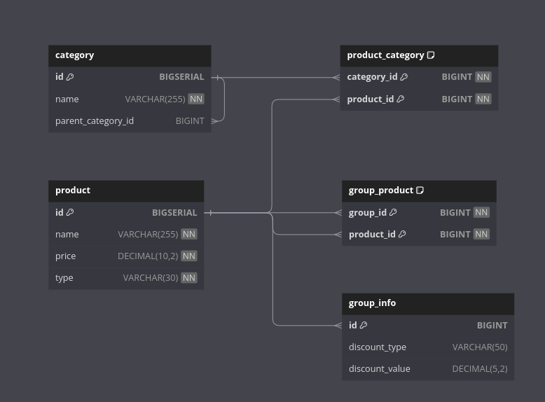

# Тестовое задание на проектирование системы "Онлайн Магазин"

Описание ТЗ лежит в файле [Тестовое-задание_Python.pdf](Тестовое-задание_Python.pdf).

В ТЗ не описаны части, которые касаются пользователей и прочей логики, так что они почти не будут затронуты ниже.

Схема бд представлена в файле [db.png](db.png).  

### Логика схемы бд

`BIGSERIAL` выбран в качестве id только из-за удобства тестирования схемы. В реальной системе можно заменить на `UUID` или оставить так же в зависимости от требований бизнеса и безопасников.

В этой схеме есть сущность `category`, которая отвечает за категории товаров и позволяет реализовать произвольную вложенность категорий. Если это корневая категория, то в поле `parent_category_id` ставится `null`, иначе id родительской категории. Таким образом можно будет рекурсивно найти все подкатегории и продукты данной категории. Ограничивать выдачу можно как по количеству строк всего, так и по уровню вложенности рекурсии.

Таблица `product` содержит как и обычные товары, так и группы товаров. Различать их помогает столбец `type`.
Если конкретная строчка отвечает за группу товаров, то для неё создаются записи в таблицах `group_product` и `group_info` с соответствующими товарами и метаинформацией группы соответственно. Объединение групп и товаров в одну таблицу позволяет просто и без лишних костылей выводить их в одном списке и взаимодействовать с ними как с одинаковыми объектами(добавлять в заказ, фильтровать).

Подсчётом цены для группы я предлагаю заниматься на уровне приложения, так как на уровне бд это сделать достаточно тяжело и такое решение будет иметь минимальную гибкость(нельзя будет предлагать персонализированные скидки, например). Реализация на уровне приложения потребует дополнительной логики, но, честно говоря, не думаю, что она будет сложной и тяжёлой в плане ресурсов(в любом случае считаться оно будет раз в N времени, и потом отправляться в кэш).

### Логика на уровне приложения

Подсчёт цены на группы предлагаю проводить здесь. Это позволит гибко настраивать цены и менять данные в бд. С учётом вложенности эти расчёты могут быть достаточно долгие, но они будут выполняться достаточно редко и/или в отложенной задаче, так что, не считаю, что это проблема. 

В качестве кэша очевидно, что `Redis`. В качестве отложенных задач `Celery`. В качестве бекенда для `Celery` и вспомогательного инструмента думаю использовать `Apache Kafka`.

Части логики, которые касаются этого ТЗ должны вмещать в себя эндпоинты:
- На получение списка товаров/групп по категории с фильтрами по категории с исключением товара, который сейчас открыт, и с ограничением на выдаваемое количество карточек;
- Карточки товара.

В целом, логика тут достаточно простая, поэтому я не стал расписывать всё в виде диаграммы UML.
